# PrepMyMeeting: Technical Deep Dive

**A comprehensive guide to the architecture, features, and implementation of PrepMyMeeting**


---

## Table of Contents

1. [Project Overview](#project-overview)
2. [System Architecture](#system-architecture)
3. [Core Features](#core-features)
4. [Database Schema](#database-schema)
5. [Key Components](#key-components)
6. [API Routes](#api-routes)
7. [Data Flow Diagrams](#data-flow-diagrams)
8. [AI & NLP Pipeline](#ai--nlp-pipeline)
9. [Advanced Features](#advanced-features)
10. [Cost Tracking & Rate Limiting](#cost-tracking--rate-limiting)
11. [Deployment & Infrastructure](#deployment--infrastructure)

---

## Project Overview

**PrepMyMeeting** is an AI-powered meeting preparation assistant that helps users get ready for appointments, meetings, and consultations through conversational chat interfaces (Telegram and WhatsApp).

### Key Stats
- **Platform**: Next.js 15.5.3 (App Router)
- **Runtime**: Edge Runtime (Vercel)
- **Database**: Supabase (PostgreSQL)
- **AI Models**: OpenAI (o4-mini, GPT-4o-mini), Whisper, Perplexity Sonar
- **Languages**: TypeScript, SQL
- **Chat Platforms**: Telegram Bot API, WhatsApp Cloud API

### What Makes It Unique
1. **Natural Language Understanding** - Parses casual messages like "I have a doctor appointment tomorrow"
2. **Contextual Memory** - Remembers past conversations and recurring meetings
3. **Multi-Modal Input** - Supports text, voice messages, and URL ingestion
4. **Web Search Integration** - Fetches current information for specific prep requests
5. **Proactive Notifications** - Google Calendar integration for automated prep suggestions

---

## System Architecture

### High-Level Architecture

```mermaid
graph TB
    subgraph "Client Layer"
        TG[Telegram Bot]
        WA[WhatsApp Bot]
        USER[User]
    end

    subgraph "Next.js App (Vercel Edge)"
        TG_API[/api/telegram]
        WA_API[/api/whatsapp]
        CAL_API[/api/calendar/google/*]
        CRON_API[/api/cron/check-upcoming-events]

        TG_API --> MSG_HANDLER[Message Handler]
        WA_API --> MSG_HANDLER

        MSG_HANDLER --> NLP[NLP Engine]
        MSG_HANDLER --> URL_PARSER[URL Parser]
        MSG_HANDLER --> AUDIO[Audio Processor]
        MSG_HANDLER --> SEARCH[Web Search]
        MSG_HANDLER --> MEMORY[Long-term Memory]

        NLP --> AI_GEN[AI Generator]
        URL_PARSER --> AI_GEN
        SEARCH --> AI_GEN
        MEMORY --> AI_GEN

        AI_GEN --> RATE_LIMIT[Rate Limiter]
        RATE_LIMIT --> DB_OPS[DB Operations]
    end

    subgraph "External Services"
        OPENAI[OpenAI API]
        WHISPER[Whisper API]
        PERPLEXITY[Perplexity API]
        GCAL[Google Calendar API]
    end

    subgraph "Data Layer"
        SUPABASE[(Supabase/PostgreSQL)]
    end

    USER -->|messages| TG
    USER -->|messages| WA
    TG -->|webhook| TG_API
    WA -->|webhook| WA_API

    AI_GEN --> OPENAI
    AUDIO --> WHISPER
    SEARCH --> PERPLEXITY
    CAL_API --> GCAL
    CRON_API --> GCAL

    DB_OPS --> SUPABASE
    MEMORY --> SUPABASE
```

### Technology Stack

**Frontend/Backend:**
- Next.js 15.5.3 (App Router, React Server Components)
- TypeScript 5
- Turbopack (dev/build)

**Database:**
- Supabase (PostgreSQL 15)
- Row Level Security (RLS)
- Real-time subscriptions (not used yet)

**AI/ML:**
- OpenAI o4-mini (primary model for prep generation)
- GPT-4o-mini (fallback, NLP classification)
- Whisper API (voice transcription)
- Perplexity Sonar (web search)

**Infrastructure:**
- Vercel (hosting, edge functions)
- Vercel Cron (scheduled tasks)
- Google Cloud (OAuth, Calendar API)

---

## Core Features

### 1. Conversational Prep Generation

**How It Works:**
1. User sends natural language message
2. Quick pattern matching filters likely prep requests
3. OpenAI classifies intent and extracts entities
4. System builds context from:
   - URL content (if link shared)
   - Past conversations
   - Recurring meeting history
   - Web search results
5. OpenAI generates personalized checklist
6. Response chunks sent via Telegram/WhatsApp

**Example Flow:**
```
User: "I have a contractor meeting tomorrow for bathroom renovation"
    ↓
NLP: intent=prep_meeting, meetingType=contractor, context=bathroom renovation
    ↓
AI: Generates checklist with questions about:
    • Budget and timeline
    • Permits and inspections
    • Materials and fixtures
    • References and insurance
    ...
```

### 2. Voice Message Transcription

**Process:**
1. User sends voice/audio message
2. Bot downloads from Telegram/WhatsApp servers
3. File validated (format, size, duration)
4. Sent to Whisper API for transcription
5. Transcribed text processed as normal message
6. Cost tracked per second of audio

**Supported Formats:**
- Telegram: OGG, MP3, M4A
- WhatsApp: OGG, AMR, MP3
- Max size: 25MB
- Estimated max duration: ~10 minutes

### 3. URL Context Extraction

**Supported URL Types:**
- LinkedIn profiles/companies
- Job postings
- Property listings (real estate)
- Restaurant pages
- General business websites

**Extraction Process:**
1. URL detected in message
2. Fetch with headless browser simulation
3. Parse HTML to extract:
   - Page title
   - Meta descriptions
   - Body content
   - Structured data (JSON-LD)
4. Classify URL type
5. Build context summary
6. Include in AI prompt

### 4. Web Search Integration (Perplexity)

**When Search Triggers:**
- Explicit: "Tell me about", "search for", "find information"
- Companies: Company names, brands
- Current events: "latest news", "recent updates"
- Specific people/places: Named entities

**Search Flow:**


### 5. Google Calendar Integration

**OAuth Flow:**

```mermaid
sequenceDiagram
    participant User
    participant WhatsApp
    participant Bot
    participant Google
    participant Supabase

    User->>WhatsApp: /connect_calendar
    WhatsApp->>Bot: Command received
    Bot->>Bot: Generate OAuth URL
    Bot->>User: Click link to authorize
    User->>Google: Authorize calendar access
    Google->>Bot: /api/calendar/google/callback?code=...
    Bot->>Google: Exchange code for tokens
    Google-->>Bot: Access + refresh tokens
    Bot->>Supabase: Store tokens
    Bot->>User: ✅ Calendar connected!
```


**Proactive Prep Flow:**
1. Vercel cron runs every hour (`/api/cron/check-upcoming-events`)
2. For each user with active calendar:
   - Fetch upcoming events (next 7 days)
   - Check if within notification window (default: 24 hours before)
   - Check if prep already sent
3. If event needs prep:
   - Auto-generate or ask user (based on preferences)
   - Send via WhatsApp
   - Mark as notification sent
4. Save checklist and link to calendar event

### 6. Long-Term Memory

**Three Types of Memory:**

**A. Session Memory (10-minute windows)**
- Tracks active conversation sessions
- Groups messages together
- Enables follow-up questions
- Auto-expires after 10 min inactivity

**B. Past Context Retrieval**
- Detects references to past conversations
- Searches by keywords in:
  - Previous checklists
  - Past messages
- Includes relevant context in new prep

**C. Recurring Meetings**
- Identifies recurring meeting patterns
- Tracks occurrence count
- References previous prep from same meeting type
- Example: "This is your 5th 1:1 with Jane. Last time you discussed..."

---

## Database Schema

### Entity Relationship Diagram

```mermaid
erDiagram
    USERS ||--o{ CONVERSATIONS : has
    USERS ||--o{ CHECKLISTS : generates
    USERS ||--o{ SUBMITTED_LINKS : submits
    USERS ||--o{ CONVERSATION_SESSIONS : has
    USERS ||--o{ USER_PREFERENCES : has
    USERS ||--o{ RECURRING_MEETINGS : tracks
    USERS ||--o{ CALENDAR_CONNECTIONS : has
    USERS ||--o{ CALENDAR_EVENTS : has
    USERS ||--o{ NOTIFICATION_SETTINGS : has
    USERS ||--o{ RATE_LIMIT_TRACKING : has

    CONVERSATION_SESSIONS ||--o{ CONVERSATIONS : contains
    CONVERSATION_SESSIONS ||--o{ CONVERSATION_SUMMARIES : summarizes

    RECURRING_MEETINGS }o--|| CHECKLISTS : references
    CALENDAR_EVENTS }o--|| CHECKLISTS : references

    USERS {
        uuid id PK
        bigint telegram_id UK
        string whatsapp_id UK
        string username
        string first_name
        string last_name
        string platform
        timestamp created_at
        timestamp updated_at
    }

    CONVERSATIONS {
        uuid id PK
        uuid user_id FK
        uuid session_id FK
        text message_text
        enum message_type
        timestamp created_at
    }

    CHECKLISTS {
        uuid id PK
        uuid user_id FK
        text topic
        text content
        timestamp created_at
    }

    CONVERSATION_SESSIONS {
        uuid id PK
        uuid user_id FK
        text topic
        boolean is_active
        timestamp last_activity_at
        timestamp created_at
    }

    USER_PREFERENCES {
        uuid id PK
        uuid user_id FK UK
        enum preferred_length
        enum preferred_tone
        int max_bullets
        boolean include_examples
        boolean include_resources
    }

    RECURRING_MEETINGS {
        uuid id PK
        uuid user_id FK
        text meeting_type
        text normalized_name
        timestamp first_occurrence
        timestamp last_occurrence
        int occurrence_count
        uuid last_checklist_id FK
    }

    CALENDAR_CONNECTIONS {
        uuid id PK
        uuid user_id FK
        string provider
        text access_token
        text refresh_token
        timestamp token_expires_at
        array scopes
        boolean is_active
    }

    CALENDAR_EVENTS {
        uuid id PK
        uuid user_id FK
        string event_id
        string calendar_id
        text summary
        text description
        timestamp start_time
        timestamp end_time
        boolean prep_notification_sent
        boolean prep_generated
        uuid checklist_id FK
    }

    NOTIFICATION_SETTINGS {
        uuid id PK
        uuid user_id FK UK
        boolean notification_enabled
        int advance_notice_hours
        boolean auto_generate_prep
    }

    RATE_LIMIT_TRACKING {
        uuid id PK
        uuid user_id FK
        int request_count
        numeric total_cost_cents
        date tracking_date
    }
```

### Key Tables

**users**
- Platform-agnostic user records
- Supports both Telegram (telegram_id) and WhatsApp (whatsapp_id)
- One user can be on both platforms

**conversations**
- All messages (user + bot)
- Linked to sessions for context
- Indexed by user_id and created_at for fast retrieval

**checklists**
- Generated prep content
- Linked to users, calendar events, recurring meetings
- Full-text searchable by topic

**conversation_sessions**
- 10-minute activity windows
- Auto-deactivated after inactivity
- Groups related messages together

**user_preferences**
- Checklist customization (length, tone, detail)
- Feature toggles
- One-to-one with users

**recurring_meetings**
- Tracks meeting patterns
- Normalized names for matching
- Links to last checklist for continuity

**calendar_connections**
- OAuth tokens for Google Calendar
- Auto-refresh on expiry
- Can be deactivated by user

**calendar_events**
- Cached calendar events
- Tracks notification state
- Links to generated checklists

**rate_limit_tracking**
- Daily request counts
- Cost tracking in cents
- Per-user limits enforced

---

## Key Components

### 1. Message Handler (`/api/telegram/route.ts`, `/api/whatsapp/route.ts`)

**Responsibilities:**
- Webhook verification
- Message parsing
- User authentication
- Session management
- Command routing
- Rate limiting
- Response chunking

**Common Flow:**
```typescript
1. Verify webhook secret
2. Parse incoming message
3. Get or create user in DB
4. Handle voice messages (if applicable)
5. Check for welcome message trigger
6. Manage sessions (deactivate old, get/create active)
7. Log user message
8. Check rate limits
9. Handle greetings
10. Parse commands or process natural language
11. Generate and send response
12. Log bot message
13. Update session activity
```

### 2. NLP Engine (`src/lib/nlp.ts`)

**Intent Classification:**
Uses OpenAI GPT-4o-mini to classify user intent:
- `prep_meeting` - New prep request
- `greeting` - Greeting message
- `help` - Help request
- `follow_up` - Question about previous response
- `refinement` - Modify previous response
- `clarification` - Explain previous response
- `unclear` - Cannot determine

**Entity Extraction:**
- Meeting type (doctor, contractor, interview, etc.)
- Context (bathroom renovation, senior engineer, etc.)
- Confidence score (0-1)

**Quick Classify (Pre-filter):**
Pattern matching for common keywords to avoid unnecessary API calls:
```typescript
meetingKeywords = [
  "doctor", "dentist", "contractor", "interview",
  "lawyer", "real estate", "restaurant", etc.
]

prepPhrases = [
  "preparing for", "have a", "meeting with",
  "appointment with", "seeing a", etc.
]
```

### 3. AI Generator (`generatePrepChecklist()`)

**Model Selection:**
- o4-mini (default): Uses Responses API
- GPT-4o-mini (fallback): Uses Chat Completions API

**Context Building:**
```typescript
Prompt = {
  system: "You're a helpful friend giving quick, practical advice...",
  user: `Topic: ${topic}
         ${pastContext ? "PAST CONTEXT: ..." : ""}
         ${urlContext ? "CONTEXT FROM URL: ..." : ""}
         ${searchContext ? "CURRENT WEB INFORMATION: ..." : ""}`
}
```

**User Preferences Applied:**
- Length: short (max N bullets), medium, long (15-20 bullets)
- Tone: formal, casual, neutral
- Examples/resources toggles

**Output Format:**
- Plain text with bullet points (•)
- Friendly intro
- 3-10 questions to ask
- 2-3 things to bring
- Optional citations (if web search used)

### 4. URL Parser (`src/lib/url-parser.ts`)

**Detection:**
```typescript
URL_REGEX = /(https?:\/\/[^\s]+)/gi
```

**Fetching:**
- Simulates browser headers
- Handles redirects
- 30-second timeout
- Max 5MB response size

**Parsing:**
```typescript
export type URLType =
  | "linkedin_profile"
  | "linkedin_company"
  | "job_posting"
  | "property_listing"
  | "restaurant"
  | "business_website"
  | "article"
  | "unknown"

interface URLInfo {
  type: URLType
  title: string
  content: string
  summary: string
  metadata: {
    author?: string
    company?: string
    location?: string
    price?: string
  }
}
```

**Type Detection:**
- LinkedIn: URL contains "linkedin.com"
- Job posting: Keywords like "job", "career", "apply"
- Property: Keywords like "bedroom", "bath", "$", "sqft"
- Restaurant: Keywords like "menu", "reservation", "cuisine"

### 5. Web Search (`src/lib/search/`)

**Detection** (`detection.ts`):
```typescript
shouldSearch(text: string): SearchDetectionResult {
  // Explicit triggers
  if (containsSearchPhrases(text)) return true

  // Company/organization names
  if (containsCapitalizedEntities(text)) return true

  // Current events
  if (containsTimeIndicators(text)) return true

  return false
}
```

**Perplexity API** (`perplexity.ts`):
```typescript
POST https://api.perplexity.ai/chat/completions
{
  model: "sonar",
  messages: [{
    role: "user",
    content: searchQuery
  }],
  return_citations: true,
  return_related_questions: false
}
```

**Configuration** (`config.ts`):
- `ENABLE_WEB_SEARCH`: Toggle feature on/off
- `SHOW_SEARCH_CITATIONS`: Show source URLs to users
- `MAX_SEARCH_CITATIONS`: Limit displayed sources (1-5)

### 6. Audio Processing (`src/lib/audio/`)

**Download** (`download.ts`):
- Telegram: Get file path → download from servers
- WhatsApp: Get media URL → download with auth token

**Validation** (`validators.ts`):
```typescript
validateAudioFile(mimeType, fileSize) {
  allowed = ["audio/ogg", "audio/mpeg", "audio/mp4", "audio/x-m4a"]
  maxSize = 25MB
}

validateAudioDuration(fileSize) {
  // Estimate: ~1MB per minute (compressed)
  estimatedDuration = fileSize / 1MB
  maxDuration = 10 minutes
}
```

**Transcription** (`transcribe.ts`):
```typescript
POST https://api.openai.com/v1/audio/transcriptions
FormData: {
  file: audioBuffer,
  model: "whisper-1",
  response_format: "verbose_json"
}

Response: {
  text: "transcribed text",
  duration: seconds
}
```

### 7. Long-Term Memory (`src/lib/long-term-memory.ts`)

**Past Reference Detection:**
```typescript
detectsPastReference(text: string) {
  patterns = [
    "last time", "before", "previously",
    "again", "another", "similar to"
  ]

  keywords = extractImportantWords(text)

  return {
    isPastReference: boolean,
    keywords: string[]
  }
}
```

**Context Retrieval:**
```typescript
findPastContext(userId, keywords) {
  checklists = searchPastChecklists(userId, keywords)
  conversations = searchPastConversations(userId, keywords)

  return { checklists, conversations }
}
```

**Recurring Meeting Detection:**
```typescript
detectRecurringPattern(text: string) {
  patterns = [
    "weekly", "monthly", "quarterly",
    "1:1 with", "standup", "sync",
    "regular", "recurring"
  ]

  if (match) {
    return {
      isRecurring: true,
      meetingType: extracted,
      frequency: detected
    }
  }
}
```

**Normalized Matching:**
```typescript
normalizeMeetingName(name: string) {
  return name
    .toLowerCase()
    .trim()
    .replace(/[^\w\s]/g, "")
    .replace(/\s+/g, " ")
}

// "1:1 with Jane" → "11 with jane"
// "Weekly Standup!" → "weekly standup"
```

### 8. Rate Limiting (`src/lib/rate-limit.ts`)

**Daily Limits:**
```typescript
LIMITS = {
  FREE_TIER: {
    maxRequests: 50,
    maxCost: 100 // cents
  }
}

COSTS = {
  O4_MINI: 5,        // cents per request
  GPT4O_MINI: 3,
  WEB_SEARCH: 2,
  WHISPER_PER_SECOND: 0.036
}
```

**Enforcement:**
```typescript
checkRateLimit(userId: string) {
  tracking = getRateLimitTracking(userId, today)

  if (tracking.request_count >= MAX_REQUESTS) {
    return {
      allowed: false,
      reason: "Daily request limit exceeded (50/day)"
    }
  }

  if (tracking.total_cost_cents >= MAX_COST) {
    return {
      allowed: false,
      reason: "Daily cost limit exceeded ($1.00/day)"
    }
  }

  return { allowed: true }
}
```

**Cost Tracking:**
- Every AI call tracked with cost
- Aggregated daily per user
- Future: upgrade tiers, billing integration

---

## API Routes

### Telegram Webhook
**POST** `/api/telegram?secret=<webhook_secret>`

**Request:**
```json
{
  "update_id": 123456789,
  "message": {
    "message_id": 1,
    "from": {
      "id": 12345678,
      "first_name": "John",
      "username": "johndoe"
    },
    "chat": { "id": 12345678 },
    "text": "I have a doctor appointment tomorrow",
    "voice": { "file_id": "...", "duration": 5 },
    "audio": { "file_id": "..." }
  }
}
```

**Response:**
```json
{ "ok": true }
```

### WhatsApp Webhook
**GET** `/api/whatsapp?hub.mode=subscribe&hub.verify_token=<token>&hub.challenge=<challenge>`

Returns the challenge for webhook verification.

**POST** `/api/whatsapp`

**Request:**
```json
{
  "entry": [{
    "changes": [{
      "value": {
        "messages": [{
          "from": "1234567890",
          "id": "wamid.XXX",
          "type": "text",
          "text": { "body": "I have a doctor appointment" }
        }],
        "contacts": [{
          "wa_id": "1234567890",
          "profile": { "name": "John Doe" }
        }]
      }
    }]
  }]
}
```

**Response:**
```json
{ "status": "ok" }
```

### Google Calendar OAuth
**GET** `/api/calendar/google/auth?userId=<uuid>`

Redirects to Google OAuth consent screen.

**GET** `/api/calendar/google/callback?code=<auth_code>&state=<userId>`

Exchanges code for tokens, stores in DB, redirects to success page.

### Set Telegram Webhook
**POST** `/api/telegram/set-webhook`

Calls Telegram's `setWebhook` API to register webhook URL.

### Cron: Check Upcoming Events
**GET** `/api/cron/check-upcoming-events` (protected by `CRON_SECRET`)

Runs hourly:
1. Get all users with active calendar connections
2. Fetch upcoming events (7 days)
3. Check notification window (advance_notice_hours)
4. Generate prep or send prompt
5. Mark as notified

---

## Data Flow Diagrams

### 1. Standard Prep Request Flow


### 2. Voice Message Flow

```mermaid
sequenceDiagram
    participant User
    participant Bot
    participant Platform as Telegram/WhatsApp
    participant Whisper as Whisper API
    participant Handler as Message Handler

    User->>Platform: Send voice message
    Platform->>Bot: Webhook with file_id
    Bot->>User: "🎤 Got your voice message! Transcribing..."
    Bot->>Platform: Download audio file
    Platform-->>Bot: Audio buffer
    Bot->>Bot: Validate format & duration
    Bot->>Whisper: Transcribe audio
    Whisper-->>Bot: { text: "...", duration: 5.2 }
    Bot->>Bot: Track Whisper cost (5.2s × $0.036/s)
    Bot->>Handler: Process as text message
    Handler->>User: Generated prep checklist
```



### 3. URL Ingestion Flow


### 4. Web Search Flow

```mermaid
sequenceDiagram
    participant User
    participant Bot
    participant SearchDetector
    participant Perplexity
    participant OpenAI

    User->>Bot: "Tell me about Acme Corp for my interview"
    Bot->>SearchDetector: shouldSearch(text)
    SearchDetector-->>Bot: { shouldSearch: true, reason: "explicit_request" }
    Bot->>Bot: Extract topic: "Acme Corp"
    Bot->>Bot: Build search query
    Bot->>Perplexity: Search "Acme Corp company information"
    Perplexity-->>Bot: { answer: "...", citations: ["url1", "url2"] }
    Bot->>Bot: Track search cost (2¢)
    Bot->>OpenAI: Generate prep with search context
    OpenAI-->>Bot: Checklist
    Bot->>Bot: Append citations (if enabled)
    Bot->>User: Send checklist + sources
```



### 5. Recurring Meeting Flow


### 6. Calendar Integration Flow


---

## AI & NLP Pipeline

### Intent Classification Prompt

```
You are an intent classifier for a meeting preparation assistant bot.

Analyze the user's message and determine:
1. Intent: What does the user want?
   - "prep_meeting": User wants help preparing for a NEW meeting/appointment
   - "greeting": User is greeting the bot
   - "help": User needs assistance/instructions
   - "follow_up": User asking a follow-up question about previous response
   - "refinement": User wants to MODIFY previous response
   - "clarification": User wants MORE INFO about previous response
   - "unclear": Cannot determine intent

IMPORTANT: Use context from conversation history to distinguish between
new prep requests and follow-ups!

2. Meeting Type (if intent is "prep_meeting"): Extract the type
   - Examples: "doctor", "dentist", "contractor", "interview", etc.

3. Context: Any additional relevant information
   - Examples: "bathroom renovation", "senior engineer position"

4. Confidence: Your confidence in the classification (0-1)

Respond ONLY with valid JSON:
{
  "intent": "prep_meeting",
  "meetingType": "contractor",
  "context": "bathroom renovation",
  "confidence": 0.95
}
```

### Prep Generation Prompt (o4-mini)

```
You're a helpful friend giving quick, practical advice for meeting prep.
Be conversational and warm. Start with a friendly intro like
'Of course! Here's what I'd ask...' or 'Sure thing! Here are the key things...'

Use plain text with simple bullets (•) - NO markdown headers or formatting.
Keep it SHORT - max 8-10 bullets total.
Focus on the most important questions and 2-3 things to bring.
Sound natural, like texting a friend.

Topic: contractor meeting - bathroom renovation

[PAST CONTEXT if available]
[CONTEXT FROM URL if available]
[CURRENT WEB INFORMATION if search was used]
```

**Example Output:**
```
Of course! Here's what I'd ask for your contractor meeting about the bathroom:

• What's your total budget and timeline?
• Does the contractor handle permits, or do you need to get them?
• Can they provide 3 recent references you can call?
• What's their policy on unexpected costs or change orders?
• Are they licensed and insured? Ask to see proof.
• What brands/materials do they recommend for fixtures?
• Do they offer a warranty on their work?

Things to bring:
• Photos/measurements of your current bathroom
• Inspiration pics of what you want
• Budget breakdown (if you have one)

Good luck! 💪
```

### Follow-Up Response Generation

When user asks follow-up question:
```typescript
systemPrompt = `You're continuing a conversation about meeting prep.
The user asked a follow-up question about your previous response.
Use the conversation context to provide a helpful, specific answer.
Keep it friendly and concise.`

userPrompt = `Previous conversation:
${conversationContext}

User's follow-up question: ${text}`
```

---

## Advanced Features

### 1. Session Management

**Purpose:** Group related messages for contextual follow-ups

**Logic:**
```typescript
// Deactivate sessions inactive >10 min
deactivateOldSessions(userId)

// Get or create active session
session = getOrCreateSession(userId, topic?)

// Log message with session link
logConversationWithSession(userId, text, type, session.id)

// Update activity timestamp
updateSessionActivity(session.id)
```

**Benefits:**
- Follow-up questions understand context
- Can reference "previous response"
- Summaries generated per session (future)

### 2. User Preferences

**Stored Preferences:**
```typescript
{
  preferred_length: "short" | "medium" | "long",
  preferred_tone: "formal" | "casual" | "neutral",
  max_bullets: 5-20,
  include_examples: boolean,
  include_resources: boolean
}
```

**Applied To:**
- AI prompt engineering
- Checklist generation
- Response style

**Future:** User commands to set preferences via chat

### 3. Welcome Message System

**Triggers:**
- First message ever from user
- User returns after 7+ days of inactivity

**Logic:**
```typescript
shouldSendWelcomeMessage(userId) {
  tracking = getWelcomeMessageTracking(userId)

  if (!tracking) return true // First time

  if (!tracking.last_message_at) return true

  daysSinceLastMessage =
    (now - tracking.last_message_at) / (24 * 60 * 60 * 1000)

  return daysSinceLastMessage >= 7
}
```

**Content:**
```
👋 Welcome to PrepMyMeeting!

I help you prepare for meetings and appointments by creating
personalized checklists and question guides.

Here's what I can do:
• 📋 Generate prep checklists for any meeting
• 🎙️ Transcribe voice messages
• 🔗 Analyze links you share
• 🔍 Search the web for current information
• 📅 Send proactive reminders from your calendar

Try telling me about your next meeting naturally, like:
"I have a doctor appointment tomorrow"

Or use commands like:
/prep doctor
/connect_calendar
/help
```

### 4. Conversation Context Building

**For Follow-Ups:**
```typescript
buildConversationContext(recentMessages) {
  // Get last 10 messages
  // Filter out greetings/commands
  // Format as "user: ...\nbot: ...\nuser: ..."
  // Truncate to 2000 chars max

  return contextString
}
```

**Detection:**
```typescript
isLikelyFollowUp(text) {
  patterns = [
    "what about", "tell me more", "how about",
    "also", "and", "but", "explain", "why",
    "can you", "could you"
  ]

  // Check if short (<50 chars) and starts with pattern
  // Or contains pattern

  return boolean
}
```

### 5. Cost Tracking & Analytics

**Tracked Metrics:**
- Request count per day
- Total cost in cents per day
- Cost per API call type

**Database:**
```sql
rate_limit_tracking (
  user_id UUID,
  request_count INT,
  total_cost_cents NUMERIC(10,2),
  tracking_date DATE
)
```

**Cost Table:**
```typescript
COSTS = {
  O4_MINI: 5,              // 5¢ per request
  GPT4O_MINI: 3,           // 3¢ per request
  WEB_SEARCH: 2,           // 2¢ per search
  WHISPER_PER_SECOND: 0.036 // 3.6¢ per minute
}
```

**Future Analytics:**
- Most common meeting types
- Average prep length
- User engagement trends
- Cost projections

---

## Cost Tracking & Rate Limiting

### Implementation Details

**Tracking Function:**
```typescript
async function trackCost(userId: string, costCents: number) {
  today = getCurrentDate()

  tracking = getRateLimitTracking(userId, today)

  if (tracking) {
    updateCost(tracking.id, {
      total_cost_cents: tracking.total_cost_cents + costCents
    })
  } else {
    createTracking({
      user_id: userId,
      request_count: 0,
      total_cost_cents: costCents,
      tracking_date: today
    })
  }
}
```

**Rate Limit Check:**
```typescript
async function checkRateLimit(userId: string) {
  tracking = getRateLimitTracking(userId, today)

  if (!tracking) return { allowed: true }

  if (tracking.request_count >= 50) {
    return {
      allowed: false,
      reason: "Daily request limit (50/day) exceeded. Try tomorrow!",
      limit: "requests"
    }
  }

  if (tracking.total_cost_cents >= 100) {
    return {
      allowed: false,
      reason: "Daily cost limit ($1.00/day) exceeded. Try tomorrow!",
      limit: "cost"
    }
  }

  return { allowed: true }
}
```

**Request Increment:**
```typescript
async function incrementRequestCount(userId: string) {
  today = getCurrentDate()

  tracking = getRateLimitTracking(userId, today)

  if (tracking) {
    updateTracking(tracking.id, {
      request_count: tracking.request_count + 1
    })
  } else {
    createTracking({
      user_id: userId,
      request_count: 1,
      total_cost_cents: 0,
      tracking_date: today
    })
  }
}
```

### Per-Request Cost Examples

| Request Type | Cost | Example |
|-------------|------|---------|
| Simple prep (o4-mini) | 5¢ | "prep for doctor" |
| With web search | 7¢ | "tell me about Acme Corp" (5¢ + 2¢) |
| Voice message (30s) | ~6¢ | 30s × 0.036¢/s + 5¢ prep |
| URL ingestion | 5¢ | Parsing is free, prep generation is 5¢ |
| Follow-up question | 3¢ | Uses GPT-4o-mini |

**Daily Allowance:**
- Free tier: 50 requests OR $1.00/day (whichever hits first)
- Average: ~14-20 preps per day (depending on complexity)

---

## Deployment & Infrastructure

### Vercel Configuration

**Environment Variables:**
```bash
# App
APP_BASE_URL=https://prepmymeeting.vercel.app

# Telegram
TELEGRAM_BOT_TOKEN=bot_token_from_botfather
TELEGRAM_WEBHOOK_SECRET=random_secret_string

# WhatsApp
WHATSAPP_PHONE_NUMBER_ID=your_phone_id
WHATSAPP_ACCESS_TOKEN=meta_access_token
WHATSAPP_WEBHOOK_VERIFY_TOKEN=verification_token

# OpenAI
OPENAI_API_KEY=sk-...
OPENAI_MODEL=o4-mini

# Perplexity
PERPLEXITY_API_KEY=pplx-...
ENABLE_WEB_SEARCH=true
SHOW_SEARCH_CITATIONS=true

# Supabase
NEXT_PUBLIC_SUPABASE_URL=https://xxx.supabase.co
NEXT_PUBLIC_SUPABASE_ANON_KEY=anon_key
SUPABASE_SERVICE_ROLE_KEY=service_role_key

# Google Calendar
GOOGLE_CLIENT_ID=xxx.apps.googleusercontent.com
GOOGLE_CLIENT_SECRET=GOCSPX-xxx
GOOGLE_REDIRECT_URI=https://prepmymeeting.vercel.app/api/calendar/google/callback

# Cron
CRON_SECRET=random_secret_for_cron
```

**Vercel Cron Jobs** (`vercel.json`):
```json
{
  "crons": [{
    "path": "/api/cron/check-upcoming-events",
    "schedule": "0 * * * *"
  }]
}
```

### Supabase Setup

1. **Create Project** on Supabase
2. **Run Migrations** in order:
   - `001_initial_schema.sql`
   - `002_fix_rls_policies.sql`
   - `003_add_whatsapp_support.sql`
   - `004_add_conversation_sessions.sql`
   - `005_add_long_term_memory.sql`
   - `006_add_rate_limiting.sql`
   - `002_calendar_integration.sql` (note: duplicate number)
   - `007_add_welcome_message_tracking.sql`

3. **Configure RLS Policies**
   - Service role bypasses RLS
   - Bot uses service role key
   - Future: user-facing features use anon key

### Telegram Bot Setup

1. **Create Bot** with [@BotFather](https://t.me/botfather)
2. **Get Token** from BotFather
3. **Set Webhook**:
   ```bash
   curl -X POST https://api.telegram.org/bot<TOKEN>/setWebhook \
     -H "Content-Type: application/json" \
     -d '{
       "url": "https://prepmymeeting.vercel.app/api/telegram?secret=<SECRET>"
     }'
   ```

4. **Verify**:
   ```bash
   curl https://api.telegram.org/bot<TOKEN>/getWebhookInfo
   ```

### WhatsApp Bot Setup

1. **Create Meta App** at [developers.facebook.com](https://developers.facebook.com)
2. **Add WhatsApp Product**
3. **Get Credentials**:
   - Phone Number ID
   - Access Token (temporary or permanent)
   - Business Account ID

4. **Configure Webhook**:
   - URL: `https://prepmymeeting.vercel.app/api/whatsapp`
   - Verify Token: (your random string)
   - Subscribe to: `messages`

5. **Test Mode**:
   - Add up to 5 test numbers
   - No business verification needed

6. **Production**:
   - Requires business verification
   - Need dedicated phone number
   - Message templates for outside 24h window

### Google Cloud Setup

1. **Create Project** in Google Cloud Console
2. **Enable APIs**:
   - Google Calendar API
   - OAuth 2.0

3. **Create OAuth Credentials**:
   - Application type: Web application
   - Authorized redirect URIs: `https://prepmymeeting.vercel.app/api/calendar/google/callback`

4. **Configure OAuth Consent Screen**:
   - User type: External
   - Scopes: `calendar.readonly`
   - Test users: Add your email

5. **Get Credentials**:
   - Client ID
   - Client Secret

---

## Performance Optimizations

### 1. Quick Classify Pre-Filter

Instead of calling OpenAI for every message:
```typescript
quickCheck = quickClassify(text)
if (!quickCheck.likelyPrep) {
  // Skip OpenAI, send fallback
  return "I'm here to help with meeting prep!"
}
// Only classify with OpenAI if likely a prep request
```

**Savings:** ~70% reduction in classification API calls

### 2. Conversation Context Truncation

```typescript
truncateContext(context, maxChars = 2000) {
  if (context.length <= maxChars) return context

  // Truncate from beginning, keep recent context
  return "... " + context.slice(-maxChars)
}
```

**Benefit:** Faster API calls, lower token costs

### 3. Message Chunking

Telegram/WhatsApp have message length limits:
```typescript
chunkForTelegram(text, max = 3500) {
  // Split on paragraphs first
  // Then sentences if needed
  // Maintain readability
}
```

**Ensures:** No message truncation, better UX

### 4. Database Indexing

Key indexes for fast queries:
```sql
CREATE INDEX idx_users_telegram_id ON users(telegram_id);
CREATE INDEX idx_users_whatsapp_id ON users(whatsapp_id);
CREATE INDEX idx_conversations_user_id ON conversations(user_id);
CREATE INDEX idx_conversations_created_at ON conversations(created_at DESC);
CREATE INDEX idx_checklists_user_id_created_at ON checklists(user_id, created_at DESC);
CREATE INDEX idx_conversation_sessions_user_active ON conversation_sessions(user_id, is_active);
CREATE INDEX idx_recurring_meetings_normalized ON recurring_meetings(normalized_name);
```

### 5. Session Deactivation

Auto-deactivate old sessions to keep queries fast:
```sql
UPDATE conversation_sessions
SET is_active = false
WHERE user_id = $1
  AND is_active = true
  AND last_activity_at < NOW() - INTERVAL '10 minutes'
```

---

## Security Considerations

### 1. Webhook Verification

**Telegram:**
```typescript
const auth = url.searchParams.get("secret")
if (auth !== TELEGRAM_WEBHOOK_SECRET) {
  return NextResponse.json({ error: "Unauthorized" }, { status: 401 })
}
```

**WhatsApp:**
```typescript
const token = searchParams.get("hub.verify_token")
if (token !== WHATSAPP_WEBHOOK_VERIFY_TOKEN) {
  return NextResponse.json({ error: "Verification failed" }, { status: 403 })
}
```

### 2. Environment Variables

- Never commit `.env.local`
- Use Vercel environment variables for production
- Rotate secrets regularly
- Use different secrets for dev/prod

### 3. Row Level Security (RLS)

Currently:
```sql
CREATE POLICY "Allow service access" ON table_name
  FOR ALL USING (true) WITH CHECK (true);
```

Bot uses service role key → bypasses RLS

**Future:** User-facing features use anon key with proper RLS:
```sql
CREATE POLICY "Users can view own data" ON conversations
  FOR SELECT USING (auth.uid()::text = user_id::text);
```

### 4. OAuth Token Security

- Tokens stored encrypted in Supabase
- Automatic token refresh
- Can be revoked by user
- No token exposure to client

### 5. Rate Limiting

- Prevents abuse
- Enforced before expensive operations
- Per-user, per-day limits
- Future: IP-based limits for malicious actors

---

## Future Enhancements

### Planned Features

1. **RAG (Retrieval Augmented Generation)**
   - Vector embeddings for past conversations
   - Semantic search for context
   - More relevant past context

2. **Voice Responses**
   - Text-to-Speech for responses
   - Send audio messages back to user

3. **Calendar Event Parsing**
   - Extract prep needs from event descriptions
   - Auto-detect meeting type from title

4. **Multi-Language Support**
   - Detect user language
   - Generate preps in user's language

5. **Export/Share Features**
   - PDF export of checklists
   - Share link for public checklists

6. **Analytics Dashboard**
   - Web dashboard for users
   - View all past preps
   - Insights and trends

7. **Premium Tier**
   - Higher rate limits
   - Priority support
   - Advanced features

8. **Slack/Discord Integrations**
   - Expand beyond Telegram/WhatsApp
   - Team meeting preps

9. **Meeting Notes Post-Mortem**
   - Record what happened
   - Compare to prep checklist
   - Improve future preps

10. **Recurring Meeting Intelligence**
    - Auto-suggest agenda based on history
    - Track action items across meetings

---

## Appendix: Code Snippets

### A. Full Prep Generation Flow

```typescript
// 1. Classify intent
const nlpResult = await classifyIntent(text, conversationHistory)

if (nlpResult.intent !== "prep_meeting" || nlpResult.confidence < 0.6) {
  return sendFallback()
}

// 2. Build topic
const topic = buildPrepTopic(nlpResult)

// 3. Load user preferences
const userPrefs = await getUserPreferences(userId)

// 4. Check for past context
const pastRef = detectsPastReference(text)
let pastContextString = ""

if (pastRef.isPastReference) {
  const pastContext = await findPastContext(userId, pastRef.keywords)
  pastContextString = buildPastContextString(
    pastContext.checklists,
    pastContext.conversations
  )
}

// 5. Check for recurring meeting
let recurringMeeting = await checkForRecurringMeeting(userId, topic)
if (!recurringMeeting) {
  const recurringPattern = detectRecurringPattern(text)
  if (recurringPattern.isRecurring) {
    recurringMeeting = await findOrCreateRecurringMeeting(
      userId,
      recurringPattern.meetingType
    )
  }
}

if (recurringMeeting) {
  pastContextString += `\n\n${buildRecurringContext(recurringMeeting)}`
}

// 6. Check if web search needed
let searchContextString = ""
let searchCitations: string[] = []

if (isSearchEnabled()) {
  const searchDetection = shouldSearch(text)

  if (searchDetection.shouldSearch) {
    const searchTopic = extractSearchTopic(text) || topic
    const searchQuery = buildPrepSearchQuery(text, searchTopic)
    const searchResult = await searchWeb(searchQuery)

    searchContextString = searchResult.answer
    searchCitations = searchResult.citations || []

    await trackCost(userId, COSTS.WEB_SEARCH)
  }
}

// 7. Generate checklist
const checklist = await generatePrepChecklist(
  topic,
  undefined, // urlContext
  pastContextString || undefined,
  searchContextString || undefined,
  userPrefs ? {
    preferred_length: userPrefs.preferred_length,
    preferred_tone: userPrefs.preferred_tone,
    max_bullets: userPrefs.max_bullets
  } : undefined
)

// 8. Track cost
const isO4 = OPENAI_MODEL.toLowerCase().startsWith("o4")
await trackCost(userId, isO4 ? COSTS.O4_MINI : COSTS.GPT4O_MINI)

// 9. Add citations
let finalChecklist = checklist
if (shouldShowCitations() && searchCitations.length > 0) {
  finalChecklist += formatCitations(searchCitations)
}

// 10. Send response
const chunks = chunkForTelegram(finalChecklist)
for (const chunk of chunks) {
  await sendTelegramMessage(chatId, chunk)
  await logConversationWithSession(userId, chunk, "bot", session.id)
}

// 11. Save to database
const { data: savedChecklist } = await supabase
  .from("checklists")
  .insert({ user_id: userId, topic, content: finalChecklist })
  .select()
  .single()

// 12. Link to recurring meeting
if (recurringMeeting && savedChecklist) {
  await updateRecurringMeeting(
    recurringMeeting.id,
    savedChecklist.id,
    topic
  )
}

// 13. Update session activity
await updateSessionActivity(session.id)
```

---

## Conclusion

PrepMyMeeting is a sophisticated AI-powered assistant that combines multiple technologies to provide personalized meeting preparation advice. Its modular architecture, intelligent context management, and careful cost tracking make it both powerful and sustainable.

Key architectural decisions:
1. **Stateless API design** - Each webhook request is self-contained
2. **Database-centric memory** - All context stored in Postgres
3. **AI-first approach** - Leverages latest OpenAI models
4. **Multi-platform support** - Shared logic for Telegram/WhatsApp
5. **Cost-conscious** - Tracks and limits API usage

This documentation should give you everything needed to understand, extend, and write about the project. For specific implementation details, refer to the source code with this guide as a reference.

---

**Last Updated:** 2025-10-30
**Version:** 1.0
**Author:** Technical documentation generated for blog post
